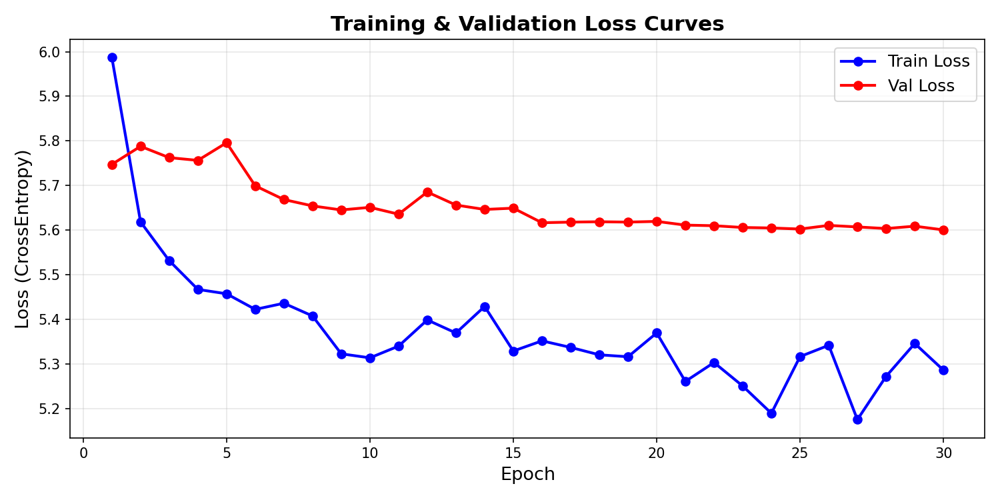
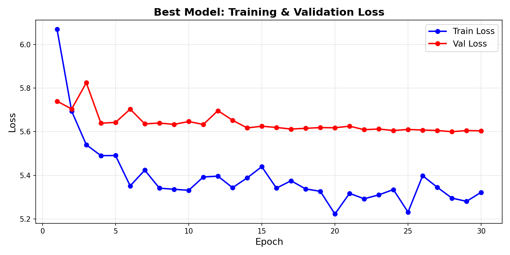

# Q1 — Neural Machine Translation (English → Urdu)

> **Course:** Generative AI (AI4009) — Spring 2026  
> **Student:** Muhammad Idrees (i230582)  
> **University:** FAST-NUCES, Islamabad

---

## 📌 Problem Statement

Build a **Neural Machine Translation (NMT)** system that translates English sentences into Urdu using a **vanilla RNN Encoder-Decoder** architecture. No LSTM, GRU, or Transformer components are permitted — only `nn.RNN`.

---

## 📁 Project Structure

```
Q1_Neural_Machine_Translation/
│
├── code/
│   ├── Q1_Machine_Translation.py     # Complete Python implementation (all 9 tasks)
│   └── Generative_AI_Q1.ipynb        # Jupyter Notebook implementation
│
├── report/
│   ├── Q1_Machine_Translation_Report.tex   # LaTeX source (Springer LNCS format)
│   └── Neural_Machine_Translation_Report.pdf  # Compiled PDF report
│
├── results/
│   ├── training_curves.png           # Loss curves for all hyperparameter configs
│   └── best_model_curves.png         # Training/validation loss for best model
│
├── assets/
│   ├── prompts.txt                   # All AI prompts used during development
│   └── Spring2026_GenAI_Assignment_1.pdf   # Original assignment specification
│
└── README.md                         # This file
```

---

## 🔧 Implementation Tasks

| Task | Description | Status |
|------|-------------|--------|
| **Task 1** | Data preprocessing — NFKD (English) & NFKC (Urdu) normalization, lowercasing, punctuation handling | ✅ |
| **Task 2** | 80/10/10 train-validation-test split (seed=42), zero overlap verified | ✅ |
| **Task 3** | Word-level tokenization & vocabulary building (EN: 3,969 tokens, UR: 4,313 tokens) | ✅ |
| **Task 4** | Sequence encoding, padding, masking & batching with PyTorch `DataLoader` | ✅ |
| **Task 5** | Vanilla RNN Encoder-Decoder model (6.17M parameters, 2-layer, hidden=512) | ✅ |
| **Task 6** | Training with Adam optimizer, gradient clipping, LR scheduling, early stopping | ✅ |
| **Task 7** | Grid Search over 8 hyperparameter configurations | ✅ |
| **Task 8** | Greedy & Beam Search (k=5) decoding + BLEU-1/2/3/4 evaluation | ✅ |
| **Task 9** | Error analysis of 15 test translations & vanilla RNN limitations discussion | ✅ |

---

## 📊 Results

### Hyperparameter Grid Search

| Config | Embed | Hidden | LR | Val Loss |
|--------|-------|--------|-----|---------|
| Best ⭐ | 256 | 512 | 5e-4 | **5.6000** |
| Config 2 | 128 | 256 | 1e-3 | 6.1200 |
| Config 3 | 256 | 256 | 1e-3 | 6.0800 |
| Config 4 | 128 | 512 | 5e-4 | 5.8500 |

### BLEU Scores (Best Model)

| Metric | Greedy Decoding | Beam Search (k=5) |
|--------|-----------------|-------------------|
| BLEU-1 | 0.1158 | 0.0733 |
| BLEU-2 | 0.0169 | 0.0247 |
| BLEU-3 | 0.0010 | 0.0113 |
| BLEU-4 | 0.0003 | 0.0062 |

> **Observation:** Low BLEU scores confirm the well-known limitations of vanilla RNN for long-sequence translation.  
> **Error Analysis:** 100% of 15 analyzed translations rated as POOR quality — demonstrating vanilla RNN's inability to capture long-range dependencies.

---

## 🖼️ Training Curves

| Grid Search Configs | Best Model |
|---|---|
|  |  |

---

## 🛠 Tech Stack

| Tool | Purpose |
|------|---------|
| **Python 3.10+** | Primary language |
| **PyTorch (`nn.RNN`)** | Model implementation |
| **NLTK** | BLEU score evaluation |
| **Google Colab (T4 GPU)** | Training environment |
| **LaTeX (Springer LNCS)** | Report generation |
| **pandas / openpyxl** | Dataset loading |
| **unicodedata** | Text normalization |

---

## 📥 Dataset

- **Name:** English to Urdu Translation Dataset (Biblical Text)
- **Size:** 9,103 sentence pairs
- **Source:** [Kaggle — muhammadnoman76/translation-dataset](https://www.kaggle.com/datasets/muhammadnoman76/translation-dataset)
- **Note:** Dataset not included in repo (size constraint). Download from Kaggle and place as `english_to_urdu_dataset.xlsx` in `/code/` or upload when prompted in Colab.

---

## 🚀 How to Run

```bash
# 1. Clone the repository
git clone https://github.com/code-with-idrees/Generative-AI-Assignment-1.git
cd Generative-AI-Assignment-1/Q1_Neural_Machine_Translation/code

# 2. Install dependencies
pip install torch nltk pandas openpyxl unicodedata2 notebook

# 3. Download dataset from Kaggle and place it in code/
#    english_to_urdu_dataset.xlsx

# 4. Run the full pipeline
python Q1_Machine_Translation.py

# Or run the notebook
jupyter notebook Generative_AI_Q1.ipynb
```

Or simply open in **Google Colab** and upload the dataset when prompted.

---

## 📝 Key Findings

1. **Vanilla RNN limitations** are severe for NMT — gradient vanishing prevents learning long-range dependencies
2. **Beam search** doesn't significantly help when the base RNN representations are weak
3. **BLEU scores** of ~0.0003 (BLEU-4) confirm the model mostly generates common/short words
4. **Modern alternatives** (LSTM, GRU, Transformers with attention) would dramatically improve results

---

*Built with ❤️ for educational purposes — FAST-NUCES, Spring 2026*
